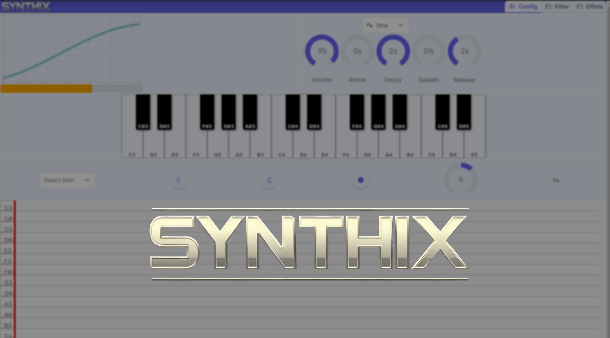

Bien sûr, voici une version améliorée de la description du début du README :

markdown
Copy code
# Synthix

Synthix est une application React JS innovante qui allie la puissance d'un synthétiseur et d'un séquenceur pour vous permettre de créer des compositions musicales uniques et captivantes. Explorez des possibilités infinies de création sonore avec une interface conviviale et des fonctionnalités avancées.

## Fonctionnalités

### Visualisation de l'onde sonore
- Explorez la fréquence et le volume de votre création sonore en temps réel.

### Modulation du son
- **Onglet Config :**
  - Ajustez le volume, l'attaque, le decay, le sustain et la release pour une modulation précise du son.
  - Choisissez parmi différentes formes d'onde telles que Sine, Sawtooth, Triangle et Square pour une diversité sonore maximale.
- **Onglet Filter :**
  - Contrôlez le cutOff pour affiner le caractère de votre son.
- **Effets :**
  - Ajoutez un effet de delay pour une profondeur sonore supplémentaire.

### Synthétiseur
- Toutes les touches d'un synthétiseur
- Raccourcis : 
  - 'w' -> "C3"
  - 's' -> "C#3"
  - 'x' -> "D3"
  - 'd' -> "D#3"
  - 'c' -> "E3"
  - 'v' -> "F3"
  - 'g' -> "F#3"
  - 'b' -> "G3"
  - 'h' -> "G#3"
  - 'n' -> "A3"
  - 'j' -> "A#3"
  - ',' -> "B3"
  - 'a' -> "C4"
  - 'é' -> "C#4"
  - 'z' -> "D4"
  - '"' -> "D#4"
  - 'e' -> "E4"
  - 'r' -> "F4"
  - '(' -> "F#4"
  - 't' -> "G4"
  - '§' -> "G#4"
  - 'y' -> "A4"
  - 'è' -> "A#4"
  - 'u' -> "B4"
  - 'i' -> "C5"
  - 'ç' -> "C#5"
  - 'o' -> "D5"
  - 'à' -> "D#5"
  - 'p' -> "E5"

### Séquenceur
- Créez, déplacez et supprimez des notes pour composer vos propres séquences musicales.
- Modifiez les notes avec les paramètres de modulation du son pour une personnalisation complète.
- Jouez, mettez en pause, rejouez et ajustez les BPM pour perfectionner votre composition.
- Des raccourcis pratiques, comme Shift + molette, vous permettent de naviguer facilement dans la timeline.

## Démo

Découvrez par vous-même les possibilités musicales de Synthix en essayant notre démo [ici](http://bastientlc.freeboxos.fr:3001/).

## Réalisateurs

Synthix a été réalisé avec passion par Bastien Talec et Jean-Marin Ribaric.
